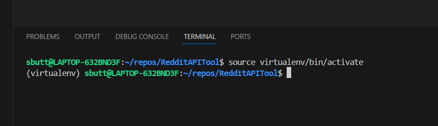

Masking Research App

Description:
This is an app to help pull data from reddit based on the search terms provided 
and save the resulting data into CSVs to be further used by analyised for a Masters Thesis on Masking

Requirements:
Need to have following installed
    - Python 3.12

Usage:

You will need to create a virtual environment to be able to run this app. This has a few packages that are required and this makes everything alot tidier to work with

1) Create a new Directory that you will be saving this code. I called mine "RedditAPITool"

2) Navigate into the newly created directory in a Terminal window.
    run the command to create a new virtual environment with the name virtualenv (You can change this to whatever you like)
    python -m venv virtualenv

3)  You will need to activate the environment to be able to work in it
    Use the following command:
    source virtualenv/bin/activate

    it should look something like this when its active
    

4)  Run the following command to install the required packages:
    pip install -r requirements.txt

5)  Once thats done, you will need to update the config.py file with your details from Reddit.

6)  Go to the constants.py file to make sure that you have the search terms you are looking for and that the sample size you want is correct.

7)  You should be ready to run the app now - in your virtual enviroment terminal that you had open earlier, run the following:
    python main.py